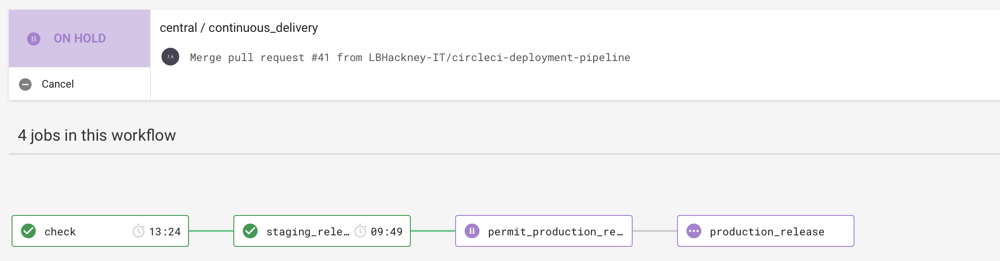

# LBH Repairs API

The Repairs API is part of the Hackney API ecosystem and is responsible for all endpoints related to repairs of homes owned and managed by the London Borough of Hackney.

## Stack

- .NET Core as a web framework.
- xUnit as a test framework.

## Dependencies

- Universal Housing
- Servitor
- DRS

## Contributing

### Setup

1. Install [Docker][docker-download].
2. Clone this repository.
3. Open it in your IDE.

### Development

To serve the application, run it using your IDE of choice. We've Visual Studio CE on Mac.

```sh
$ docker run -it --rm repairs-api dotnet HackneyRepairs.dll
```
To run on particular port,the command is as below.
```sh
$ docker run -p 3000:80 -it --rm repairs-api dotnet HackneyRepairs.dll
```
### Release process



We use a pull request workflow, where changes are made on a branch and approved by one or more other maintainers before the developer can merge into `central`.

Then we have an automated four step deployment process, which runs in CircleCI.

1. Automated tests (xUnit) are run to ensure the release is of good quality.
2. The app is deployed to staging automatically, where we check our latest changes work well.
3. We manually confirm a production deployment in the CircleCI workflow once we're happy with our changes in staging.
4. The app is deployed to production.

Our staging and production enviornments are hosted by AWS. We would deploy to production per each feature/config merged into  `central`  branch.

## Testing

### Universal Housing tests

We use the [Universal Housing Simulator][universal-housing-simulator] to test the UHT and UH Warehouse repositories.

You must have it running locally on port 1433 for these tests to run, otherwise they'll be automatically skipped.

To build and run the simulator, follow these steps:

```sh
$ git clone https://github.com/LBHackney-IT/lbh-universal-housing-simulator
$ cd lbh-universal-housing-simulator
$ docker build -t uhsimulator .
$ docker run -ti -p 1433:1433 --rm uhsimulator
```
You can then run the tests using the test explorer in your IDE.

## Endpoints
 [Endpoints](docs/endpoints.md)
 
## Contacts

### Active Maintainers

- **Richard Foster**, Lead Engineer at [Made Tech][made-tech] (richard@madetech.com)
- **Miguel Saitz**, Junior Developer at London Borough of Hackney (miguel.saitz@hackney.gov.uk)

### Other Contacts

- **Rashmi Shetty**, Development Manager at London Borough of Hackney (rashmi.shetty@hackney.gov.uk)

[docker-download]: https://www.docker.com/products/docker-desktop
[Endpoints]: docs/endpoints.md

